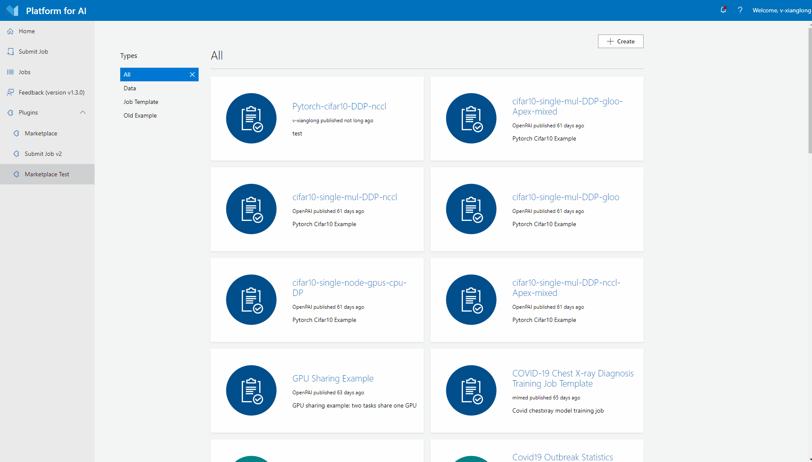

# Create Template

At current version (v1.4.0), the marketplace only support create job template. Create job template has 4 steps:

1. Click `Create` button at top right corner.
2. Upload OpenPAI protocol yaml file.
3. Select type as "Job Template", fill other required form fields, then click "Next" button.
4. Check template details and click "Next" button, then job template will be created successfully.

OpenPAI protocol yaml examples can be found [here](https://github.com/microsoft/openpaimarketplace/tree/master/examples/item_protocols).
