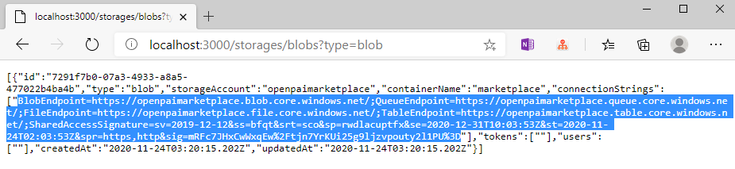
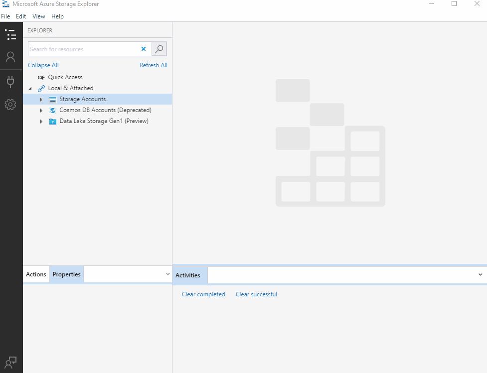

# Data Management

OpenPAI Marketplace uses [Azuere Blob Storage](https://docs.microsoft.com/en-us/azure/storage/blobs/) as data storage system. In marketplace, it is recommended to use Azure Storage Explorer as data management tool for both upload and download, and pai-copy tool as an CLI utility to help process data.

## Data Management by Azure Storage Explorer

### Installation

As prerequisites, you need download and install [Azure Storage Explorer](https://azure.microsoft.com/en-us/features/storage-explorer/) at first.

### Get Connection String

It is suggested to use connection string to authorize Azure Storage Explorer access. Marketplace provide an api `https://<openpaimarketplace_rest_server_url>/storages/blobs?type=blob` to get a connection string for Azure Blob. You could use it directly in Azure Storage Explorer.



### Connect to Azure Storage Service

Following gif shows how to use connection string in Azure Storage Explorer to connect to your Azure Storage Service. The main steps are:

1. Click "Open Connect Dialog" button at sidebar.
2. Select "Use a connection string" option.
3. Paste your connection string. If there warns you any connection string error, you should go and see [SAS authentication tutorial](https://docs.microsoft.com/en-us/azure/active-directory/managed-identities-azure-resources/tutorial-linux-vm-access-storage-sas) to get the right access.
4. Trust and connect.



After connection established, you can browse, download and upload files. For detailed usage, see [Azure Storage Explorer Documents](https://azure.microsoft.com/zh-cn/features/storage-explorer/).

## Data Upload by pai-copy

[pai-copy](https://github.com/SwordFaith/pai-copy) is an CLI tool to help user upload their data in OpenPAI jobs. It requires user to define an `OUTPUT_DIR` environment variable to store target directory or file path.

To use pai-copy tool, the code snippet are as following. The marketplace will automatically add this when create job from templates. For more detailed usage, please refer to [pai-copy documentation](https://github.com/SwordFaith/pai-copy)

```bash
curl -sL https://deb.nodesource.com/setup_10.x -o nodesource_setup.sh
bash nodesource_setup.sh
apt update
apt install -y nodejs
npm config set @swordfaith:registry https://npm.pkg.github.com/
echo "//npm.pkg.github.com/:_authToken=<your_npm_install_token>" >> ~/.npmrc
npm install -g @swordfaith/pai_copy
export STORAGE_CONNECTION_STRING="<your_connection_string>"

<your_code_here>

# pai_copy upload [filePath] [containerName] [blobFolder]
if [ -z ${OUTPUT_DIR+x}]; then
  echo "Not found OUTPUT_DIR environ"
else
  pai_copy upload ${OUTPUT_DIR} <your_container> ${PAI_USER_NAME}/${PAI_JOB_NAME}/
fi
```
